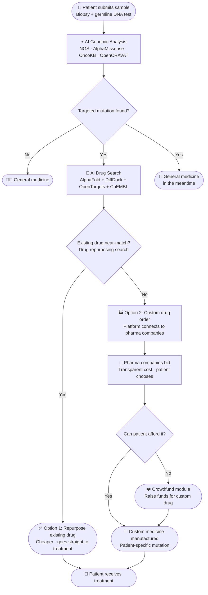

<div align="center">


<p>
  
</p>

<p>
  <a href="https://github.com/immortal71/openoncology/stargazers">
    
  </a>
  <a href="https://github.com/immortal71/openoncology/network/members">
    
  </a>
  <a href="https://github.com/immortal71/openoncology/issues">
    
  </a>
  <a href="https://github.com/immortal71/openoncology/blob/main/LICENSE">
    
  </a>
</p>

<p>
  
  
  
  
  
</p>

<br/>

<p align="center"><i>Free genomic analysis and AI-powered drug repurposing for every cancer patient — no subscription, no insurance required.</i></p>

</div>


---

## Platform preview

<div align="center">
<table>
<tr>
<td align="center" width="33%">
  
  <br/><b>Patient Dashboard</b>
  <br/><sub>Upload VCF · Track analysis · View results</sub>
</td>
<td align="center" width="33%">
  
  <br/><b>AI Analysis Results</b>
  <br/><sub>Mutations · Pathogenicity · Drug candidates</sub>
</td>
<td align="center" width="33%">
  
  <br/><b>Pharma Marketplace</b>
  <br/><sub>Competitive bidding · Stripe escrow · KYC</sub>
</td>
</tr>
<tr>
<td align="center" width="33%">
  
  <br/><b>Crowdfunding</b>
  <br/><sub>Raise funds · Milestone notifications</sub>
</td>
<td align="center" width="33%">
  
  <br/><b>Oncologist Review Portal</b>
  <br/><sub>Review mutations · Approve drug orders</sub>
</td>
<td align="center" width="33%">
  
  <br/><b>Drug Ranking Engine</b>
  <br/><sub>DiffDock · OpenTargets · OncoKB scores</sub>
</td>
</tr>
<tr>
<td align="center" width="33%">
  
  <br/><b>Custom Drug Discovery</b>
  <br/><sub>Target brief · ChEMBL leads · Oral-exposure scoring</sub>
</td>
<td align="center" width="33%">
  
  <br/><b>Custom Drug Orders</b>
  <br/><sub>Patient order tracking · Lead molecule handoff</sub>
</td>
<td align="center" width="33%">
  
  <br/><b>Manufacturer Bidding Portal</b>
  <br/><sub>Pharma receives brief · Bids on custom synthesis</sub>
</td>
</tr>
</table>
</div>


---

## What is OpenOncology?

Upload a VCF file. Get a ranked list of drugs that may work against your specific mutations — with the protein structure, docking scores, and clinical evidence to back it.

The pipeline runs a full clinical-grade variant calling workflow (FastQC → BWA-MEM2 → GATK), scores each mutation with [AlphaMissense](https://alphamissense.hegelab.org/), folds the mutated protein via AlphaFold Server, docks candidate compounds using DiffDock, and ranks everything by a weighted composite of binding confidence, OncoKB actionability, COSMIC frequency, and clinical trial phase. Results include a plain-English summary generated by GPT-4o (falls back to a template — no API key needed).

If an existing approved drug matches, the patient gets a repurposing suggestion immediately. If no suitable repurposed drug is found, the platform switches to a custom-drug path: it builds a target-specific discovery brief from live OpenTargets and ChEMBL evidence, summarizes why the target is still actionable, and packages the lead candidates for pharmaceutical manufacturers to review through the marketplace. If cost is a barrier, there's an integrated crowdfunding module.

Everything is open-source. No paywalls. No insurance checks.

---

## Truth-only runtime behavior

OpenOncology now keeps patient-visible output strictly aligned with persisted backend state:

- Results stay `in progress` until the analysis pipeline or worker stack writes a real completed result. The API no longer fabricates a local completed submission in development mode.
- Custom-drug discovery briefs expose `evidence_sources` and `matched_terms` derived from live OpenTargets and ChEMBL data, so the visible attribution reflects the real upstream evidence used to rank or explain a candidate.
- If no cancer-matched lead is available for the current target and disease context, the brief returns integration issues instead of placeholder drug recommendations.

### Repurposing to custom-drug escalation

The treatment search is intentionally two-stage:

1. The platform first searches for an existing or repurposable therapy that matches the patient's mutation and disease context.
2. If that search is weak or empty, the backend generates a custom discovery brief for the same target.
3. That brief includes live target-drug evidence, mechanism-of-action context, molecular properties, and ranked candidate leads.
4. The marketplace then uses that brief so manufacturers can bid on producing a custom therapy rather than pretending a repurposed option exists.

This keeps the demo and local environment aligned with the same truth-only contract expected in production.

---

## 🧪 Custom Drug Discovery Pipeline

When no repurposable drug matches a patient's mutation profile, OpenOncology doesn't stop — it escalates to a fully automated custom drug discovery workflow.

### How it works

```
Mutation profile (no repurposing match)
        │
        ▼
[custom_drug_worker] triggered async via Celery
        │
        ├─► AlphaFold Server  →  Mutation-specific protein structure (.cif → .pdb)
        │
        ├─► OpenTargets GraphQL  →  Approved / clinical-stage drugs for the target
        │
        ├─► ChEMBL REST  →  Lead molecules with SMILES, molecular weight, LogP, PSA
        │
        ├─► Oral-Exposure Scoring (Lipinski Ro5)  →  Ranks leads by druggability
        │
        └─► Discovery Brief assembled  →  Saved to DrugRequest job in PostgreSQL
                │
                ▼
        Pharma marketplace: manufacturers receive brief and bid on synthesis
```

### What the discovery brief contains

| Field | Source | Purpose |
|:------|:-------|:--------|
| **Target gene & disease context** | Patient submission | Frames the molecule design goal |
| **Ranked lead molecules** | OpenTargets + ChEMBL | Existing compounds close to the target |
| **Molecular properties** | ChEMBL (MW, LogP, PSA, HBD/HBA) | Druggability / ADMET proxy |
| **Oral-exposure score** | Ro5 algorithm | Prioritises bioavailable candidates |
| **Clinical phase** | OpenTargets | Signals translational readiness |
| **Scaffold / fragment notes** | Medicinal-chemistry heuristics | Handoff guidance for synthesis teams |
| **Mutation-specific structure** | AlphaFold Server | 3-D docking context for manufacturer |

### Frontend

The custom drug UI lives at `/custom-drug/[id]` and lets patients:
- Track job status (pending → processing → ready)
- View ranked lead molecules with molecular properties
- See the de-novo discovery brief generated for their mutation
- Enter the marketplace to receive manufacturer bids

### Scoring formula

Leads are ranked by a composite score weighting clinical phase, binding evidence, and oral-exposure druggability. Scores are clamped to [0, 1] and surfaced directly in the brief so pharma teams can audit the prioritisation logic.

---

## 🚀 Quick Start (3 Minutes)

### Prerequisites
- Docker & Docker Compose
- OR: Python 3.11+, Node.js 18+, PostgreSQL, Redis, MinIO

### Run Everything with Docker

```bash
# Clone the repo
git clone https://github.com/immortal71/openoncology.git
cd openoncology

# Copy .env template and fill in your secrets
cp .env.example .env

# Start all services (backend, frontend, database, workers, auth)
docker-compose up -d

# Wait ~30 seconds for services to initialize...

# Access the platform
open http://localhost:3000
```

**API Documentation:** http://localhost:8000/docs  
**Keycloak Admin:** http://localhost:8080 (admin / admin)

### Run Locally (Development)

**Backend:**
```bash
cd api
python -m venv .venv
source .venv/bin/activate  # Windows: .venv\Scripts\activate
pip install -r requirements.txt
alembic upgrade head
uvicorn main:app --reload
```

**Frontend:**
```bash
cd web
npm install
npm run dev
```

Then open http://localhost:3000

---

## ✅ Validation Status

**Backend:** ✅ All 11 routes, 4 workers + custom_drug_worker, 11 models import successfully  
**Frontend:** ✅ TypeScript compilation with 0 errors  
**Database:** ✅ Schema fully defined + migrations  
**Security:** ✅ HIPAA auditing, GDPR compliance, rate limiting, JWT auth  
**DevOps:** ✅ Docker Compose stack complete + Kubernetes manifests

See [PROJECT_COMPLETION_STATUS.md](PROJECT_COMPLETION_STATUS.md) for detailed feature checklist.

---

## What's inside

| Area | Details |
|:-----|:--------|
| **Genomics pipeline** | Nextflow · FastQC · Trimmomatic · BWA-MEM2 · GATK · OpenCRAVAT · GRCh38 |
| **AI scoring** | AlphaMissense (3.6 GB SQLite) · AlphaFold Server · DiffDock · GPT-4o |
| **Drug evidence** | OpenTargets GraphQL · ChEMBL REST · OncoKB · ClinVar · CIViC · COSMIC v3.1 · cBioPortal |
| **Ranking** | DiffDock 30% + OpenTargets 25% + OncoKB 25% + AlphaMissense 10% + Phase 10% |
| **Custom drug discovery** | Target-specific discovery brief · ChEMBL lead molecules · oral-exposure (Ro5) scoring · scaffold/fragment library · medicinal-chemistry handoff notes |
| **Custom drug worker** | Async Celery worker · AlphaFold mutation-structure generation · DrugRequest job status polling |
| **Marketplace** | Stripe Connect Express — pharma KYC, competitive bids, escrow, automatic payout |
| **Crowdfunding** | Milestone webhooks at 25/50/75/100% · Stripe Elements · direct transfer to pharma |
| **Auth & access** | Keycloak OIDC/OAuth2 · roles: patient · oncologist · admin |
| **Compliance** | HIPAA §164.308/310/312 · GDPR Art. 17 erasure + Art. 20 export · audit middleware |
| **Security CI** | Weekly: pip-audit · npm audit · Bandit · Semgrep OWASP · ZAP baseline · Trivy |

---

## Patient journey

<div align="center">

</div>



<div align="center">

### AI pipeline — from mutation to ranked drug list

<table>
<tr>
<td align="center" width="12%">
  
  <br/><b>AlphaMissense</b>
  <br/><sub>pathogenicity<br/>score</sub>
</td>
<td align="center" width="2%">→</td>
<td align="center" width="12%">
  
  <br/><b>OncoKB</b>
  <br/><sub>actionability<br/>level</sub>
</td>
<td align="center" width="2%">→</td>
<td align="center" width="12%">
  
  <br/><b>COSMIC</b>
  <br/><sub>tumour-type<br/>frequency</sub>
</td>
<td align="center" width="2%">→</td>
<td align="center" width="12%">
  
  <br/><b>cBioPortal</b>
  <br/><sub>cross-study<br/>evidence</sub>
</td>
<td align="center" width="2%">→</td>
<td align="center" width="12%">
  
  <br/><b>AlphaFold</b>
  <br/><sub>protein<br/>structure</sub>
</td>
<td align="center" width="2%">→</td>
<td align="center" width="12%">
  
  <br/><b>DiffDock</b>
  <br/><sub>drug<br/>docking</sub>
</td>
<td align="center" width="2%">→</td>
<td align="center" width="12%">
  
  <br/><b>Ranking</b>
  <br/><sub>composite<br/>score</sub>
</td>
<td align="center" width="2%">→</td>
<td align="center" width="12%">
  
  <br/><b>GPT-4o</b>
  <br/><sub>plain-English<br/>summary</sub>
</td>
</tr>
</table>

</div>


## 🏗️ System Architecture

<div align="center">


</div>


---

## 🛠️ Tech Stack

<div align="center">


<br/><br/>

| Layer | Technologies |
|:------|:------------|
| **Frontend** | Next.js 14 · TypeScript · Tailwind CSS · Framer Motion · React Query |
| **Backend** | FastAPI · SQLAlchemy 2 async · Celery · Redis |
| **Database** | PostgreSQL 16 · Alembic migrations (12 tables) |
| **Storage & Auth** | MinIO (AES-256) · Keycloak OIDC/OAuth2 |
| **Genomics** | Nextflow · FastQC · BWA-MEM2 · GATK · OpenCRAVAT |
| **AI / ML** | AlphaMissense · AlphaFold Server · DiffDock · GPT-4o |
| **Drug Databases** | OpenTargets GraphQL · ChEMBL REST · COSMIC v3.1 · OncoKB · ClinVar · CIViC |
| **Custom Drug Discovery** | `drug_discovery.py` service · `custom_drug_worker` Celery task · Ro5 oral-exposure scoring · ChEMBL lead pipeline |
| **Payments** | Stripe Connect Express (KYC + escrow + competitive bidding) |
| **DevOps** | Docker Compose · Kubernetes/Helm · Prometheus · Grafana · GitHub Actions |

</div>


## 🚀 30-Second Quickstart

<div align="center">

</div>

```bash
# 1. Clone the repository
git clone https://github.com/immortal71/openoncology
cd openoncology

# 2. Configure your secrets
cp .env.example .env
# Open .env and set:
#   DB_PASSWORD              — any secure password
#   MINIO_SECRET_KEY         — MinIO root secret
#   KEYCLOAK_ADMIN_PASSWORD  — Keycloak admin console password
#   SECRET_KEY               — 32+ random characters for JWT signing
#   ONCOKB_API_TOKEN         — free academic token at oncokb.org
#   OPENAI_API_KEY           — optional: enables GPT-4o plain-language summaries

# 3. Start all 10 services with one command
docker compose up -d
```

Once running, open these in your browser:

| Service | URL | Credentials |
|:--------|:----|:------------|
| 🌐 Patient web app | http://localhost:3000 | Register via Keycloak |
| 📖 FastAPI interactive docs | http://localhost:8000/docs | — |
| 🗄️ MinIO object storage | http://localhost:9001 | `minioadmin` / from `.env` |
| 🔑 Keycloak admin | http://localhost:8080 | `admin` / from `.env` |
| 📊 Prometheus metrics | http://localhost:9090 | — |
| 📈 Grafana dashboards | http://localhost:3001 | `admin` / `admin` |

> **First run**: The API starts with live table creation in development mode.
> Run `alembic upgrade head` for migration-managed environments.

---

## ☁️ Production Kubernetes Deploy

```bash
# Add Bitnami sub-chart dependencies
helm dependency update infra/helm

# Deploy to your cluster
helm upgrade --install openoncology infra/helm \
  --namespace openoncology --create-namespace \
  -f infra/helm/values.production.yaml \
  --set secrets.postgresPassword="$DB_PASSWORD" \
  --set secrets.secretKey="$SECRET_KEY" \
  --set secrets.oncokbToken="$ONCOKB_API_TOKEN"
```

The production chart includes HorizontalPodAutoscaler, cert-manager TLS, NGINX ingress, Pod Security Standards (`restricted`), and deny-all NetworkPolicy with explicit allow-lists.

---

## 📁 Platform Documents

| Document | Description |
|:---------|:------------|
| [📄 OpenOncology_Project_Concept.pdf](OpenOncology_Project_Concept.pdf) | Full project concept — vision, business model, and technical overview |
| [📝 OpenOncology_TechStack.docx](OpenOncology_TechStack.docx) | Detailed tech stack breakdown and architecture decisions |
| [🔒 HIPAA Compliance Checklist](docs/HIPAA_COMPLIANCE.md) | §164.308/310/312 safeguards, GDPR overlap, and incident response |

---

## 🔐 Security & Privacy

OpenOncology handles **protected health information (PHI)** and is built with security as a first-class concern:

| Control | Implementation |
|:--------|:---------------|
| **Authentication** | Keycloak OIDC/OAuth2 · Role-based: `patient` · `oncologist` · `admin` |
| **Encryption in transit** | TLS 1.3 enforced · HSTS headers in production ingress |
| **Encryption at rest** | AES-256 on MinIO · PostgreSQL WAL encrypted |
| **HIPAA Audit Logging** | `AuditMiddleware` logs every PHI access: user, path, IP, duration |
| **Rate Limiting** | Redis-backed SlowAPI (120 req/min · strict limits on auth + upload) |
| **GDPR Compliance** | `GET /api/me/export` (Art. 20) · `DELETE /api/me` cascade erasure (Art. 17) |
| **Automated Security Scanning** | Weekly CI: `pip-audit` · `npm audit` · Bandit SAST · Semgrep OWASP · ZAP baseline · Trivy |

---

## 🤝 Contributing

Each service is independently deployable — you don't need to understand the whole system to contribute:

```bash
# Frontend only
cd web && npm install && npm run dev
# Served at localhost:3000 — set NEXT_PUBLIC_API_URL=http://localhost:8000

# Backend only
cd api && pip install -r requirements.txt
uvicorn main:app --reload

# AI pipeline only
cd ai && pip install -r requirements.txt
python -m pytest

# Run the full stack lint + test suite (same as CI)
ruff check api/         # Python linting
cd web && npx tsc       # TypeScript type check
cd api && pytest        # Backend tests
```

**To contribute:**

1. 🍴 Fork the repo
2. 🌿 Create a branch: `git checkout -b feat/your-feature`
3. ✅ Make your changes and add tests
4. 📬 Open a PR against `main`

Pick an open [issue](https://github.com/immortal71/openoncology/issues) labeled `good first issue` to get started.

---

## 🗓️ Roadmap

<div align="center">

| Phase | Status | Milestone |
|:-----:|:------:|:----------|
| **Phase 1** | ✅ | Infrastructure · FastAPI · Next.js · Nextflow pipeline |
| **Phase 2** | ✅ | Real mutation detection · OncoKB/ClinVar/CIViC · Oncologist portal |
| **Phase 3** | ✅ | AlphaMissense · AlphaFold · DiffDock · Drug ranking algorithm |
| **Phase 4** | ✅ | Pharma marketplace · Stripe Connect · Crowdfunding module |
| **Phase 5** | ✅ | Kubernetes/Helm deploy · HIPAA/GDPR compliance · Security CI |
| **Phase 5.5** | ✅ | Custom drug discovery pipeline · ChEMBL lead scoring · `custom_drug_worker` · `/custom-drug/[id]` UI · DrugRequest job tracking |
| **Phase 6** | 🔜 | Multi-omics (RNA-seq, methylation) · Federated learning · Mobile app |


</div>

---

## ⚠️ Disclaimer

This platform is for **research and educational purposes only**. Genomic analysis results require professional clinical interpretation. **Always consult a qualified oncologist before making any treatment decisions.** OpenOncology does not provide medical advice, diagnosis, or treatment.

---

---

<div align="center">


### Built with these technologies


<br/><br/>


<br/><br/>

<a href="https://github.com/immortal71/openoncology">
  
</a>
&nbsp;
<a href="https://github.com/immortal71/openoncology/fork">
  
</a>
&nbsp;
<a href="https://github.com/immortal71/openoncology/issues">
  
</a>
&nbsp;
<a href="https://github.com/immortal71/openoncology/issues">
  
</a>

</div>


