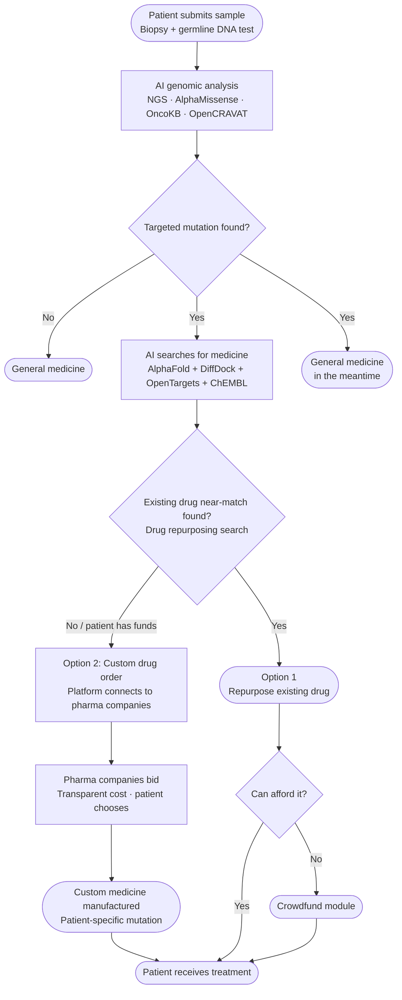

# OpenOncology

OpenOncology gives any cancer patient free genomic mutation analysis and AI-powered drug repurposing suggestions.

Upload a VCF file → the platform identifies your mutations, classifies their pathogenicity with AlphaMissense, folds the mutated protein with AlphaFold Server, docks candidate drugs with DiffDock, ranks them by binding affinity and clinical evidence, and returns a plain-English summary alongside the mutation data. Patients can crowdfund rare treatments and connect directly with pharmaceutical manufacturers through an integrated bidding marketplace.

---

## 30-Second Quickstart

```bash
# 1. Clone
git clone https://github.com/immortal71/openoncology
cd openoncology

# 2. Configure secrets
cp .env.example .env
# Edit .env:  set POSTGRES_PASSWORD, MINIO_SECRET_KEY,
#             KEYCLOAK_ADMIN_PASSWORD, ONCOKB_API_TOKEN (free at oncokb.org)
#             OPENAI_API_KEY (optional — enables plain-language summaries)

# 3. Start every service with Docker Compose
docker compose up -d

# Open the app
open http://localhost:3000        # patient web app
open http://localhost:8000/docs   # FastAPI interactive docs
open http://localhost:9001        # MinIO console  (minioadmin / from .env)
open http://localhost:8080        # Keycloak admin  (admin / from .env)
```

The first `docker compose up` also runs Alembic migrations and creates MinIO buckets automatically.

---

## Platform Documents

| Document | Description |
|---|---|
| [📄 OpenOncology_Project_Concept.pdf](OpenOncology_Project_Concept.pdf) | Full project concept — vision, business model, and technical overview |
| [📝 OpenOncology_TechStack.docx](OpenOncology_TechStack.docx) | Detailed tech stack breakdown and architecture decisions |

---

## Patient Journey Flowchart



---

## Architecture

```
openoncology/
├── web/              # Next.js 14 patient web app
│   └── app/
│       ├── results/[id]/      # 5-section results page
│       └── marketplace/       # drug synthesis bidding
├── api/              # FastAPI backend
│   ├── routes/                # REST endpoints
│   ├── workers/               # Celery: genomic · ai · notify
│   ├── services/              # COSMIC, cBioPortal, LLM explainer
│   └── alembic/versions/      # DB migrations
├── ai/               # ML pipeline
│   ├── services/alphafold.py  # AlphaFold Server API client
│   ├── alphamissense/         # pathogenicity scorer
│   └── diffdock/              # protein–ligand docking
├── pipeline/         # Nextflow bioinformatics (FastQC → BWA → GATK)
└── infra/            # Docker Compose, Kubernetes Helm chart
```

### Request flow

```
Patient uploads VCF
        │
        ▼
 genomic_worker (Nextflow / GATK variant calling)
        │  mutations written to DB
        ▼
 ai_worker
  1. AlphaMissense  →  pathogenicity score per mutation
  2. OncoKB         →  actionability level (Level 1 = FDA-approved drug)
  3. COSMIC         →  tumour sample count for context
  4. cBioPortal     →  frequency across cancer studies
  5. AlphaFold      →  fold mutated protein sequence → .cif → MinIO
  6. DiffDock       →  dock each candidate drug against mutated structure
  7. Ranking        →  composite score (binding + clinical evidence + approval)
  8. LLM explainer  →  plain-English summary (GPT-4o or template fallback)
        │
        ▼
 results page       →  5 sections: summary · mutation details ·
                        COSMIC/cBioPortal · drug candidates · oncologist review
        │
        ▼
 Marketplace        →  patient posts drug synthesis request
                        pharma companies bid · Stripe payment on accept
```

---

## Tech Stack

| Layer | Technology |
|---|---|
| Frontend | Next.js 14, TypeScript, Tailwind CSS, Framer Motion |
| Backend | FastAPI, SQLAlchemy 2 async, Celery, Redis |
| Database | PostgreSQL 16 (12 tables, Alembic migrations) |
| Storage | MinIO (S3-compatible, AES-256 encrypted) |
| Auth | Keycloak (OIDC/OAuth2) |
| Genomics | Nextflow, FastQC, BWA-MEM2, GATK, OpenCRAVAT |
| AI/ML | AlphaMissense, AlphaFold Server, DiffDock |
| Drug data | OpenTargets GraphQL, ChEMBL REST, COSMIC REST v3.1, cBioPortal |
| Payments | Stripe Connect Express (pharma KYC + competitive bidding) |
| DevOps | Docker Compose, Kubernetes/Helm, Prometheus, Grafana |

---

## Environment Variables

| Variable | Required | Description |
|---|---|---|
| `POSTGRES_PASSWORD` | ✅ | PostgreSQL password |
| `MINIO_SECRET_KEY` | ✅ | MinIO root secret |
| `KEYCLOAK_ADMIN_PASSWORD` | ✅ | Keycloak admin console |
| `SECRET_KEY` | ✅ | FastAPI JWT signing key (32+ random chars) |
| `ONCOKB_API_TOKEN` | ✅ | Free academic token from oncokb.org |
| `OPENAI_API_KEY` | optional | GPT-4o plain-language summaries |
| `STRIPE_SECRET_KEY` | optional | Enables pharma bidding payments |
| `COSMIC_EMAIL` / `COSMIC_PASSWORD` | optional | COSMIC REST v3.1 access |

---

## Contributing

Each service is independently deployable — you don't need to understand the whole system to contribute:

- **Frontend only**: `cd web && npm install && npm run dev` (uses `NEXT_PUBLIC_API_URL=http://localhost:8000`)
- **Backend only**: `cd api && pip install -r requirements.txt && uvicorn main:app --reload`
- **AI pipeline**: `cd ai && pip install -r requirements.txt`

Pick an open issue, make a PR against `main`.

---

## Disclaimer

This platform is for research and educational use only. Genomic analysis results require professional interpretation. Always consult a qualified oncologist before making any treatment decisions.

---

MIT License · [github.com/immortal71/openoncology](https://github.com/immortal71/openoncology)
