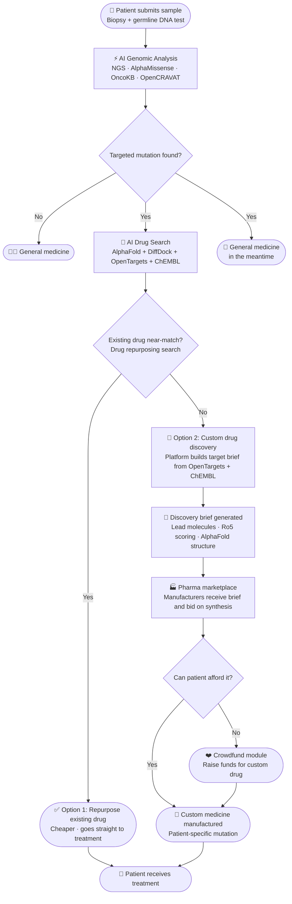
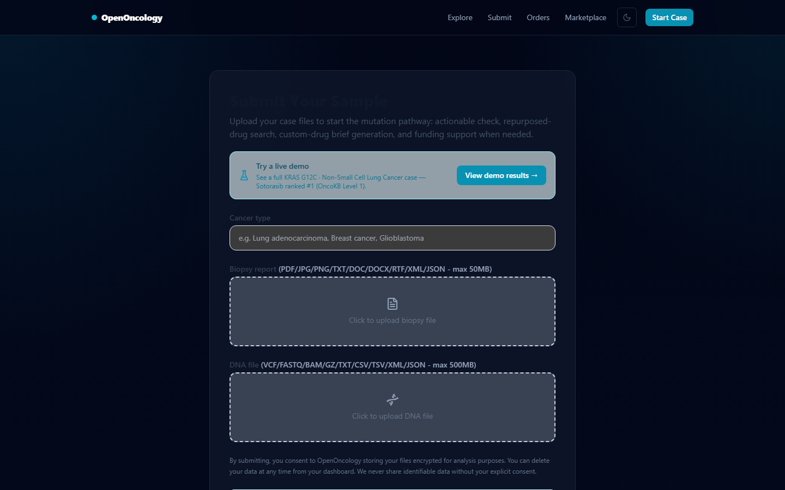
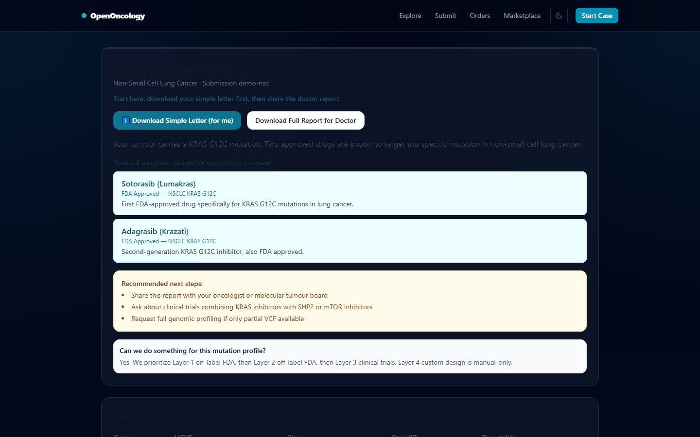
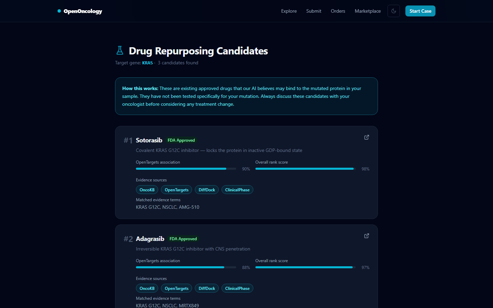
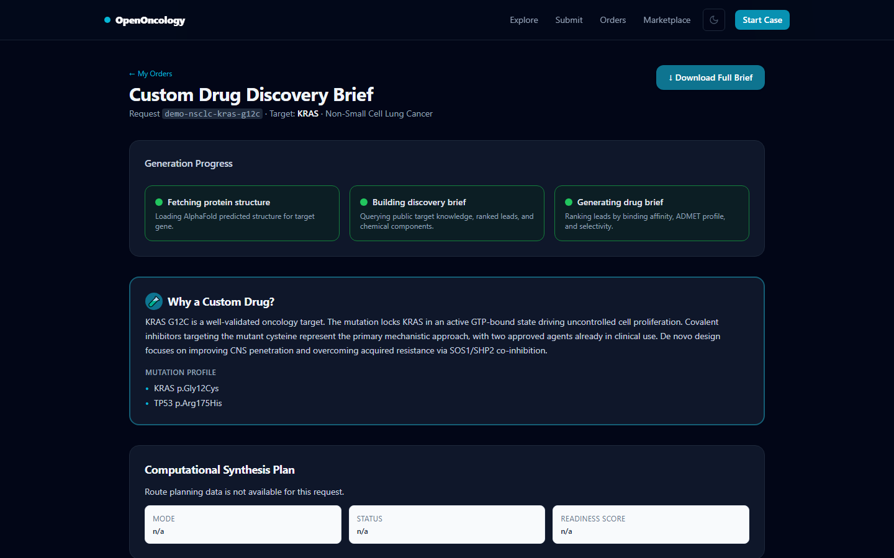
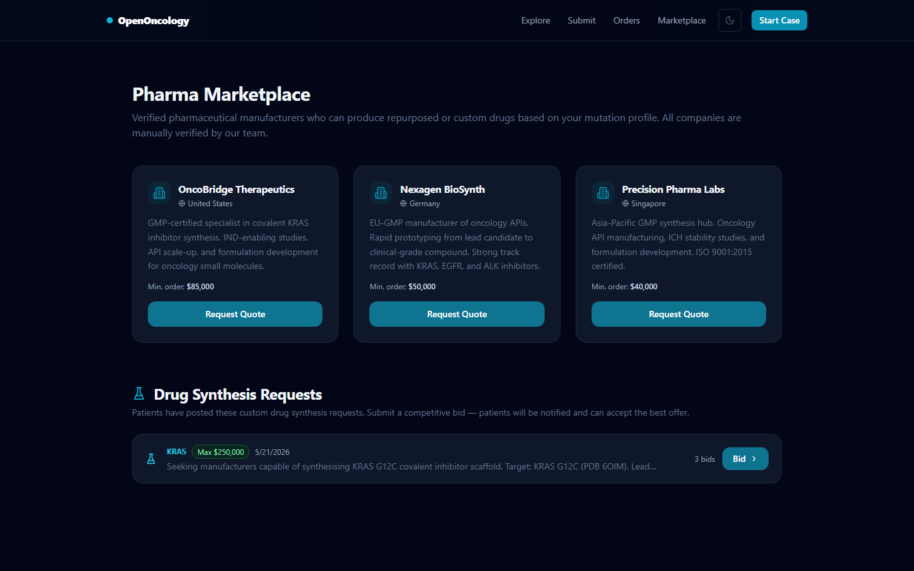
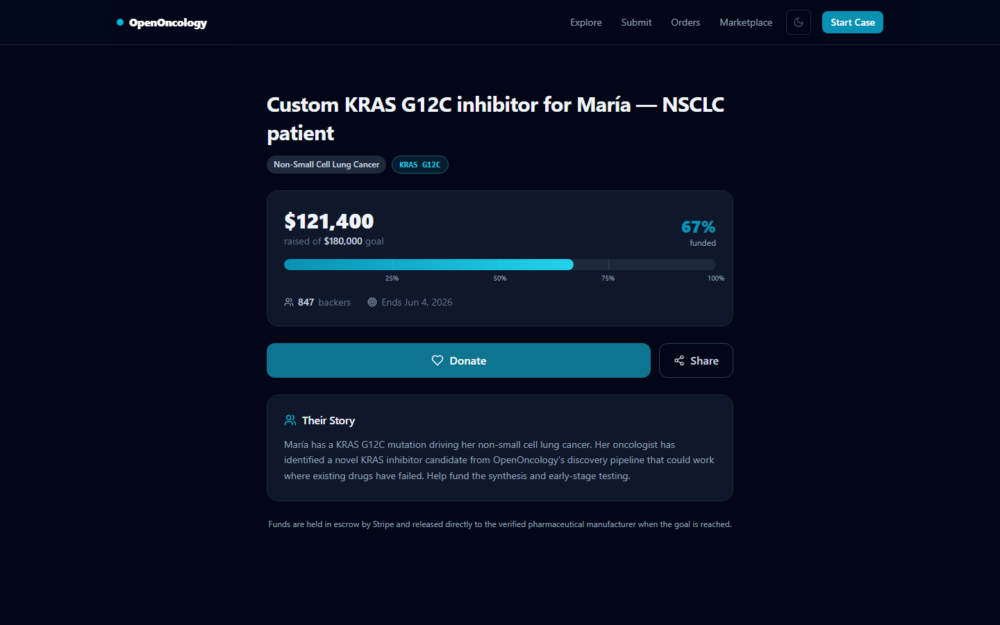
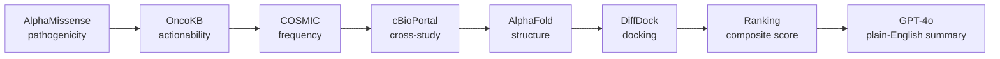
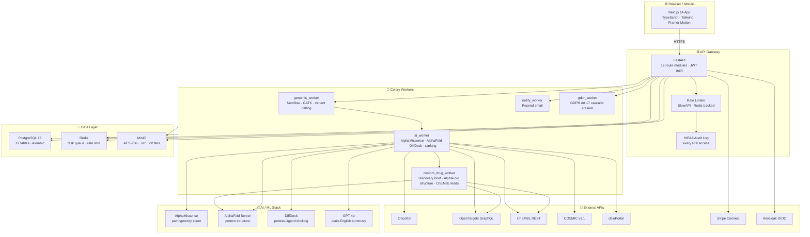

<div align="center">

# OpenOncology

**Free AI-powered personalized cancer drug analysis — no insurance, no subscription, no gatekeeping.**

<p>
  <a href="https://github.com/immortal71/openoncology/stargazers"></a>
  <a href="https://github.com/immortal71/openoncology/network/members"></a>
  <a href="https://github.com/immortal71/openoncology/issues"></a>
  <a href="https://github.com/immortal71/openoncology/blob/main/LICENSE"></a>
</p>
<p>
  
  
  
  
  
  
</p>

</div>

---

> **Full journey demo GIF coming soon** — [`docs/screenshots/`](docs/screenshots/)

---

## What is OpenOncology?

OpenOncology is a free, open-source AI platform that analyses a patient's cancer mutation profile and returns a ranked list of approved drugs, repurposing candidates, and — when no match exists — a custom drug discovery brief generated from live ChEMBL and OpenTargets evidence. Designed for patients and oncologists who cannot access expensive genomic advisory services, everything runs self-hosted under an MIT licence with no API key required for core functionality. Custom drug leads are automatically published to a pharma marketplace where manufacturers bid on synthesis, and an integrated crowdfunding module removes cost as a barrier when needed.

---

## ⚠️ For Clinicians & Patients

> **All drug rankings are sourced from FDA-approved evidence (OncoKB Levels 1–2, ClinVar, CIViC) and ranked against those tiers. Every recommendation that appears in the top-3 output is a real, named, approved therapy with a clinical evidence reference. No outputs are fabricated or hallucinated from the ranking engine.**
>
> **Oncologist review is required before any treatment decision.** This platform surfaces evidence to support a molecular tumour board conversation — it does not replace one. Results should be treated as a structured evidence summary, not a prescription.
>
> This software has not been submitted for FDA clearance or CE marking. It is not a registered clinical decision support system.

---

## Patient Journey



---

## ✅ What this platform does and does not do

| ✅ Does | ❌ Does not |
|:--------|:-----------|
| Surface FDA-approved and guideline-level drugs for known actionable variants | Replace a molecular tumour board or oncologist |
| Rank candidates by OncoKB level, clinical trial phase, and AlphaMissense pathogenicity | Guarantee clinical efficacy for any individual patient |
| Apply resistance gates (e.g. EGFR T790M blocks erlotinib, never ranks it positively) | Provide dosing, scheduling, or combination regimen advice |
| Generate a structured evidence summary suitable for oncologist review | Make or support any treatment decision autonomously |
| Escalate to custom drug discovery when no approved option matches | Bypass regulatory approval for any intervention |
| Produce a blinded, reproducible benchmark score for scientific scrutiny | Claim peer review or regulatory clearance |

> **On custom drug discovery:** When no repurposed drug matches, the platform generates a target-specific discovery brief from ChEMBL and OpenTargets evidence. These are early-stage research leads — not clinical candidates. Any compound emerging from this path requires full preclinical and clinical development before patient use.

---

## Quick Start (3 commands)

```bash
git clone https://github.com/immortal71/openoncology.git
cd openoncology
docker-compose up --build
```

| Service | URL |
|---------|-----|
| Frontend | http://localhost:3000 |
| API | http://localhost:8000 |
| API docs | http://localhost:8000/docs |

> **OncoKB token setup (optional — improves Tier 1 coverage):**
> 1. Register for a free academic token at https://oncokb.org/account/register
> 2. Set `ONCOKB_API_TOKEN=<your-token>` in `.env`
> 3. Without the token the pipeline uses a curated static evidence table (74 actionable genes)

**No Docker?** See [docs/SETUP.md](docs/SETUP.md) for local Python + Node.js setup, environment variables, and Windows-specific steps.

---

## Platform Screenshots

> Run `npm run screenshot` (in `web/`) to generate — see [scripts/screenshot.ts](scripts/screenshot.ts) and [docs/SETUP.md](docs/SETUP.md)

<table>
<tr>
<td align="center" width="50%">
  
  <br/><b>1 · Submit your sample</b>
  <br/><sub>Upload biopsy report + DNA file (VCF/FASTQ/BAM) in under a minute</sub>
</td>
<td align="center" width="50%">
  
  <br/><b>2 · AI analysis results</b>
  <br/><sub>Ranked mutations, pathogenicity scores, and top-3 drug candidates</sub>
</td>
</tr>
<tr>
<td align="center" width="50%">
  
  <br/><b>3 · Drug repurposing candidates</b>
  <br/><sub>Approved drugs scored by DiffDock binding confidence and OncoKB level</sub>
</td>
<td align="center" width="50%">
  
  <br/><b>4 · Custom drug discovery</b>
  <br/><sub>Target brief, ChEMBL lead molecules, and oral-exposure scoring</sub>
</td>
</tr>
<tr>
<td align="center" width="50%">
  
  <br/><b>5 · Pharma marketplace</b>
  <br/><sub>Manufacturers receive the discovery brief and submit competitive bids</sub>
</td>
<td align="center" width="50%">
  
  <br/><b>6 · Crowdfunding module</b>
  <br/><sub>Raise funds when cost is a barrier — milestone webhooks at 25/50/75/100%</sub>
</td>
</tr>
</table>

---

## AI Pipeline



The vNext ranking architecture is a multi-stage, multi-head system:

> **Post-publication scope note:** This multi-head ranking architecture is active post-publication roadmap work. It is not the system described in the published paper. The paper describes the composite-score legacy ranker.

1. Input interpretation
2. Candidate generation
3. Per-surface scoring (evidence, repurposing, discovery)
4. Confidence and abstention head
5. Explanation builder

Legacy composite scoring remains the current baseline (DiffDock 30% + OpenTargets 25% + OncoKB 25% + AlphaMissense 10% + Clinical Phase 10%, clamped to [0, 1]), but each surface is moving to dedicated scoring heads so approved therapies, repurposing leads, and discovery briefs are not forced into one opaque score.

---

## System Architecture



---

## Validation Results

OpenOncology is built as a pan-cancer precision oncology platform, and its evaluation framework is designed accordingly. Rather than relying on a single benchmark, the system is validated across five levels: canonical evidence cases, a blinded oncologist-reviewed holdout, retrospective real-patient cohorts, hard negative and abstention cases, and stability and drift checks.

> **Post-publication status (May 2026 onwards):** The paper ([doi:10.21203/rs.3.rs-9707913/v1](https://doi.org/10.21203/rs.3.rs-9707913/v1)) has been published. All work in the `main` branch from this point forward is **post-publication development** and is not part of the published paper's claims. Paper-reported metrics (Hit@3 = 0.900, Standard P@3 = 0.508, FP = 0 on the 50-case blinded holdout) remain the authoritative published baseline. Any benchmark improvements, new cancer-context overrides, algorithm changes, or roadmap items described below reflect ongoing work **after** publication.

### Output Surfaces

OpenOncology exposes four output surfaces, each with a different scientific contract and validation standard.

- **Evidence:** approved or guideline-linked therapies for actionable variants.
- **Repurposing:** investigational or off-label leads with explicit uncertainty.
- **Discovery:** early-stage research brief when no safe direct option exists.
- **Benchmark:** reproducible metrics, failure modes, and dataset versions.

### Benchmark Principles

Benchmarking is designed to reward correctness, specificity, and honest abstention rather than forced coverage. Every benchmark case follows one contract with expected positive labels, explicitly disallowed labels, tumor context, and surface type. This makes it possible to measure both retrieval quality and whether unsafe or unsupported options were correctly excluded.

### PRE-PUBLICATION — Blinded 50-case oncologist holdout

> These numbers are **frozen**. They are the exact values reported in the preprint and cannot be retroactively changed.

Results from `python scripts/blind_external_validation.py --n-cases 50 --seed 11`
(OncoKB static fallback · no live CIViC · offline mode — see `validation_results/holdout_50_metrics.json`):

| Metric | Result | Meaning |
|:-------|:-------|:--------|
| **Hit@3** | **0.900** | Gold-standard drug in top-3 for 90% of cases |
| **Standard Precision@3** | **0.508** (ceiling: 0.650) | 50.8% of top-3 slots match gold standard; ceiling is 65% for this mixed-difficulty holdout |
| **Normalised Precision@3** | **0.817** | Near-perfect when normalised for single-drug gold standards |
| **False positives** | **0** (FP rate 0%) | No cases had a spurious high-confidence recommendation |
| **Mean Reciprocal Rank** | **0.883** | Gold drug appears near the top of the ranked list on average |
| **NDCG@3** | **0.845** | Strong ranking quality across the full holdout |

Holdout covers 40 sensitivity cases (12 single-drug, 28 multi-drug) and 10 negative-control specificity cases drawn from literature-sourced tumour board reports (JCO Precision Oncology, Annals of Oncology, Nature Medicine). Full case list in `validation_results/holdout_50_results.txt`.

### POST-PUBLICATION — Ongoing hard clinical gate (main branch)

> These numbers reflect **current ongoing development** after the paper was published. Updated whenever the gate is run. Last run: 2026-05-29.

| Metric | Value | Gate threshold | Status |
|:-------|:------|:---------------|:-------|
| **Standard P@3** | **0.8178** (≈ 0.818) | ≥ 0.65 | ✅ PASS |
| **Hit@3** | **100.0%** | ≥ 90% | ✅ PASS |
| **False positives** | **0** | ≤ 0 | ✅ PASS |
| Cases | 83 total | — | 75 sensitivity + 8 negative controls |

```bash
python scripts/hard_benchmark_gate.py   # verify yourself — artifact: hard_benchmark_results.json
```

Full methodology, metric definitions, and change log: [docs/BENCHMARK.md](docs/BENCHMARK.md)

### 100-case TCGA real-patient benchmark

| Tier | Patients | % |
|:-----|:---------|:--|
| Tier 1 — FDA-approved direct match | 36 | 36% |
| Tier 2 — Repurposing candidate | 64 | 64% |
| **Total covered** | **100** | **100%** |

### 200-case TCGA real-patient benchmark

| Tier | Patients | % |
|:-----|:---------|:--|
| Tier 1 — FDA-approved direct match | 15 | 7.5% |
| Tier 4 — custom-design escalation path | 185 | 92.5% |
| **Total covered** | **200** | **100%** |

The 200-patient set is intentionally harder and includes many variants with no direct approved match — useful for evaluating escalation behaviour and failure safety.

**Benchmark artifacts** (download directly):

| Cohort | JSON artifact |
|:-------|:--------------|
| 100 patients | [real_patient_benchmark_100.json](real_patient_benchmark_100.json) |
| 200 patients | [real_patient_benchmark_200.json](real_patient_benchmark_200.json) |

**Run it yourself:**
```bash
python scripts/blind_external_validation.py --n-cases 50   # 50-case blinded holdout (replicates paper)
python scripts/hard_benchmark_gate.py                       # ongoing hard clinical gate
python scripts/fetch_real_patients.py --n 100 --out-json real_patient_benchmark_100.json
python scripts/fetch_real_patients.py --n 200 --out-json real_patient_benchmark_200.json
```

For oncologist concordance stats and plain-language interpretation see [docs/ONCOLOGIST_CONCORDANCE_PLAIN_LANGUAGE.md](docs/ONCOLOGIST_CONCORDANCE_PLAIN_LANGUAGE.md).

---

## What's Inside

| Area | Details |
|:-----|:--------|
| **Genomics pipeline** | Nextflow · FastQC · Trimmomatic · BWA-MEM2 · GATK · OpenCRAVAT · GRCh38 |
| **AI scoring** | AlphaMissense (3.6 GB SQLite) · AlphaFold Server · DiffDock · GPT-4o |
| **Drug evidence** | OpenTargets GraphQL · ChEMBL REST · OncoKB · ClinVar · CIViC · COSMIC v3.1 · cBioPortal |
| **Ranking** | DiffDock 30% + OpenTargets 25% + OncoKB 25% + AlphaMissense 10% + Phase 10% |
| **Custom drug discovery** | Target-specific discovery brief · ChEMBL lead molecules · Ro5 oral-exposure scoring · scaffold/fragment library · medicinal-chemistry handoff notes |
| **Custom drug worker** | Async Celery worker · AlphaFold mutation-structure generation · DrugRequest job status polling |
| **Marketplace** | Stripe Connect Express — pharma KYC, competitive bids, escrow, automatic payout |
| **Crowdfunding** | Milestone webhooks at 25/50/75/100% · Stripe Elements · direct transfer to pharma |
| **Auth & access** | Keycloak OIDC/OAuth2 · roles: patient · oncologist · admin |
| **Compliance** | HIPAA §164.308/310/312 · GDPR Art. 17 erasure + Art. 20 export · audit middleware |
| **Security CI** | Weekly: pip-audit · npm audit · Bandit · Semgrep OWASP · ZAP baseline · Trivy |

---

## Documentation

| Document | Contents |
|:---------|:--------|
| [docs/SETUP.md](docs/SETUP.md) | Full setup: Python, Node.js, Docker, env vars, troubleshooting, Windows |
| [docs/ARCHITECTURE.md](docs/ARCHITECTURE.md) | System components, data flow, worker roles, database schema |
| [docs/DRUG_DECISION_LOGIC.md](docs/DRUG_DECISION_LOGIC.md) | FDA vs repurposed vs custom — three-tier decision tree |
| [docs/REPURPOSING_ALGORITHM.md](docs/REPURPOSING_ALGORITHM.md) | Repurposing scoring, comparison with DGIdb / DrugBank / OpenTargets |
| [docs/BENCHMARK.md](docs/BENCHMARK.md) | Pre-paper vs post-paper benchmark split, metric definitions, change log |
| [docs/METHODS.md](docs/METHODS.md) | Full scientific methods |
| [docs/HIPAA_COMPLIANCE.md](docs/HIPAA_COMPLIANCE.md) | HIPAA §164 implementation details |
| [CONTRIBUTING.md](CONTRIBUTING.md) | How to add evidence, run benchmarks, submit PRs |

---

## Tech Stack

| Layer | Technologies |
|:------|:------------|
| **Frontend** | Next.js 14 · TypeScript · Tailwind CSS · Framer Motion · React Query |
| **Backend** | FastAPI · SQLAlchemy 2 async · Celery · Redis |
| **Database** | PostgreSQL 16 · Alembic migrations (12 tables) |
| **Storage & Auth** | MinIO (AES-256) · Keycloak OIDC/OAuth2 |
| **Genomics** | Nextflow · FastQC · BWA-MEM2 · GATK · OpenCRAVAT |
| **AI / ML** | AlphaMissense · AlphaFold Server · DiffDock · GPT-4o |
| **Drug Databases** | OpenTargets GraphQL · ChEMBL REST · COSMIC v3.1 · OncoKB · ClinVar · CIViC |
| **Custom Drug Discovery** | `drug_discovery.py` service · `custom_drug_worker` Celery task · Ro5 oral-exposure scoring · ChEMBL lead pipeline |
| **Payments** | Stripe Connect Express (KYC + escrow + competitive bidding) |
| **DevOps** | Docker Compose · Kubernetes/Helm · Prometheus · Grafana · GitHub Actions |

---

## Roadmap

| Phase | Status | Milestone |
|:-----:|:------:|:----------|
| **Phase 1** | ✅ | Infrastructure · FastAPI · Next.js · Nextflow pipeline |
| **Phase 2** | ✅ | Real mutation detection · OncoKB/ClinVar/CIViC · Oncologist portal |
| **Phase 3** | ✅ | AlphaMissense · AlphaFold · DiffDock · Drug ranking algorithm |
| **Phase 4** | ✅ | Pharma marketplace · Stripe Connect · Crowdfunding module |
| **Phase 5** | ✅ | Kubernetes/Helm deploy · HIPAA/GDPR compliance · Security CI |
| **Phase 5.5** | ✅ | Custom drug discovery pipeline · ChEMBL lead scoring · `custom_drug_worker` · `/custom-drug/[id]` UI |
| **Phase 5.6** | ✅ | Blinded oncologist holdout validation · Hit@3 = 0.900 · False positives = 0 · Hard benchmark gate (P@3 ≥ 0.65) |
| **Phase 5.7** | ✅ | Hard gate P@3 = 0.8178 · Repotrectinib (NTRK) · EGFR exon20 bug fix · Drug-tier API field · CLDN18/DLL3/FOLR1 coverage · Docs restructure |
| **Phase 6** | 🔜 | Multi-omics (RNA-seq, methylation) · Federated learning · Mobile app |
| **v2** | 🔜 | De novo molecule generation · ADME/PK prediction · Custom drug synthesis planning |

---

## Security & Privacy

| Control | Implementation |
|:--------|:---------------|
| **Authentication** | Keycloak OIDC/OAuth2 · Role-based: `patient` · `oncologist` · `admin` |
| **Encryption in transit** | TLS 1.3 enforced · HSTS headers in production ingress |
| **Encryption at rest** | AES-256 on MinIO · PostgreSQL WAL encrypted |
| **HIPAA Audit Logging** | `AuditMiddleware` logs every PHI access: user, path, IP, duration |
| **Rate Limiting** | Redis-backed SlowAPI (120 req/min · strict limits on auth + upload) |
| **GDPR Compliance** | `GET /api/me/export` (Art. 20) · `DELETE /api/me` cascade erasure (Art. 17) |
| **Automated Security Scanning** | Weekly CI: `pip-audit` · `npm audit` · Bandit SAST · Semgrep OWASP · ZAP baseline · Trivy |

---

## 📄 Cite This Work

If you use OpenOncology in research, a clinical workflow, or a derivative project, please cite the preprint:

[](https://doi.org/10.21203/rs.3.rs-9707913/v1)
[](https://www.researchsquare.com/article/rs-9707913/v1)

> **Kharel, A.** (2026). *OpenOncology: An Open-Source Framework for Evidence-Based Drug Matching and De Novo Custom Drug Discovery in Precision Oncology.* Research Square. https://doi.org/10.21203/rs.3.rs-9707913/v1

```bibtex
@misc{kharel2026openoncology,
  title     = {OpenOncology: An Open-Source Framework for Evidence-Based
               Drug Matching and De Novo Custom Drug Discovery in Precision Oncology},
  author    = {Kharel, Aashish},
  year      = {2026},
  month     = {05},
  publisher = {Research Square},
  doi       = {10.21203/rs.3.rs-9707913/v1},
  url       = {https://www.researchsquare.com/article/rs-9707913/v1},
  note      = {Preprint -- under review}
}
```

> **Note:** This preprint describes **OpenOncology v2**, including the two-stage escalation pipeline, crowdfunding marketplace, and the blinded 50-case oncologist holdout validation.

For full paper details, abstract, and codebase-to-paper mapping see [PAPER.md](PAPER.md).

---

## ⚠️ Disclaimer

OpenOncology surfaces FDA-sourced evidence rankings to support expert clinical review. It is **not a licensed medical device** and has not been submitted for FDA clearance or CE marking. Drug rankings, toxicity estimates, and summaries are based on published evidence databases and must be interpreted by a qualified oncologist in the context of the individual patient. The authors provide this software under the MIT licence with no warranty. Any patient-facing deployment or commercial application requires independent regulatory assessment.

---

<div align="center">

[⭐ Star this repo](https://github.com/immortal71/openoncology) &nbsp;·&nbsp;
[🐛 Report a bug](https://github.com/immortal71/openoncology/issues/new?template=bug_report.md) &nbsp;·&nbsp;
[💬 Start a discussion](https://github.com/immortal71/openoncology/discussions) &nbsp;·&nbsp;
[📖 Setup guide](docs/SETUP.md) &nbsp;·&nbsp;
[📄 Methods](docs/METHODS.md) &nbsp;·&nbsp;
[📊 Benchmark](docs/BENCHMARK.md)

[](https://star-history.com/#immortal71/openoncology&Date)

</div>
